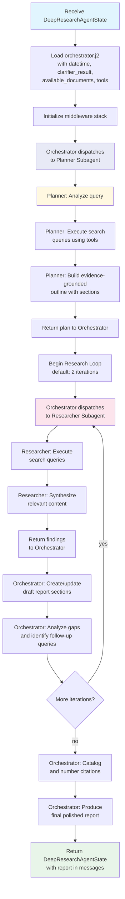
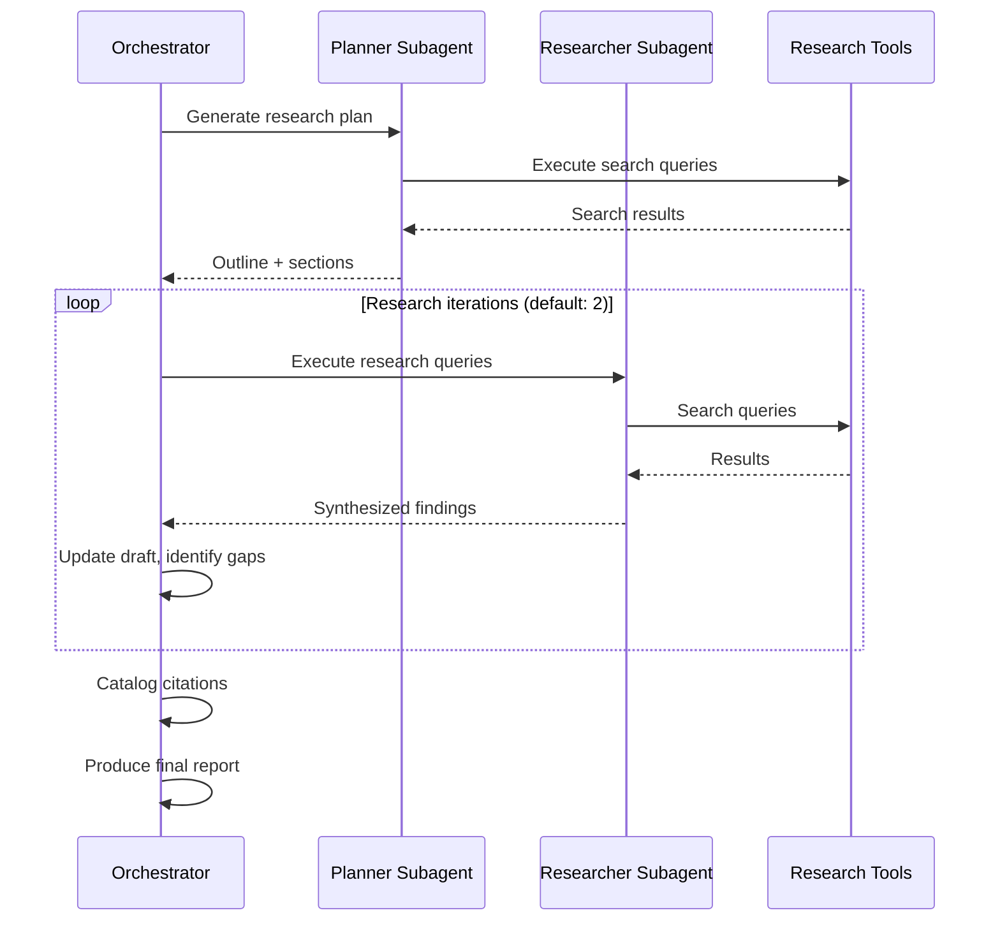

<!--
SPDX-FileCopyrightText: Copyright (c) 2025-2026, NVIDIA CORPORATION & AFFILIATES. All rights reserved.
SPDX-License-Identifier: Apache-2.0
-->

# Deep Researcher Agent

The Deep Researcher produces publication-ready research reports through a
multi-phase iterative workflow. It coordinates specialized subagents under
an orchestrator using the [`deepagents`](https://docs.langchain.com/oss/python/deepagents/overview) library.

**Location:** `src/aiq_agent/agents/deep_researcher/agent.py`

## Purpose

The deep path handles queries that require comprehensive investigation:
multi-step research, comparative analyses, and topics that benefit from
structured planning and iterative refinement. It produces long-form reports
with inline citations and numbered references.

## Internal Flow



### Orchestrator-Subagent Interaction



## Subagent Roles

| Subagent | LLM Role | Description |
| -------- | -------- | ----------- |
| Orchestrator | `ORCHESTRATOR` | Coordinates subagents, manages research loops, synthesizes drafts, catalogs citations, produces the final report |
| `planner-agent` | `PLANNER` | Iteratively builds evidence-grounded outlines through interleaved search and outline optimization; creates 4-6 strategic search queries mapped to report sections |
| `researcher-agent` | `RESEARCHER` | Executes search queries using configured tools and synthesizes relevant content from available sources |

All subagents and the orchestrator share a `think` tool in addition to the
configured research tools. The `think` tool lets the agent record reasoning,
verify constraints, or plan next steps without taking any external action.

## Middleware Stack

The orchestrator and all subagents share a common middleware stack:

| Middleware | Purpose |
| ---------- | ------- |
| `EmptyContentFixMiddleware` | Replaces empty `ToolMessage` content with a placeholder to prevent LLM API rejections (custom) |
| `ToolNameSanitizationMiddleware` | Sanitizes corrupted or hallucinated tool names from LLM responses (custom) |
| `ModelRetryMiddleware` | Retries model calls with exponential backoff (max 10 retries) on transient failures |

The agent is constructed with `create_deep_agent` from the [`deepagents`](https://docs.langchain.com/oss/python/deepagents/overview) library (a [LangChain](https://docs.langchain.com/) library),
which manages subagent coordination internally. Subagents are passed directly
to `create_deep_agent` rather than being routed through middleware.

## State Model

### DeepResearchAgentState

| Field | Type | Default | Description |
| ----- | ---- | ------- | ----------- |
| `messages` | `Annotated[list[AnyMessage], add_messages]` | required | Conversation history with LangGraph message reducer |
| `data_sources` | `list[str]` or `None` | `None` | User-selected data source IDs for tool filtering |
| `user_info` | `dict` or `None` | `None` | User information |
| `tools_info` | `list[dict]` or `None` | `None` | Available tools information |
| `todos` | `list[dict]` | `[]` | Todo list for research task tracking |
| `files` | `dict` | `{}` | Virtual filesystem for state persistence (uses merge reducer) |
| `subagents` | `list[dict]` | `[]` | Subagent status tracking |
| `clarifier_result` | `str` or `None` | `None` | Clarification log and approved plan context from the Clarifier |
| `available_documents` | `list[AvailableDocument]` or `None` | `None` | User-uploaded documents with summaries |

The `clarifier_result` field is injected into the orchestrator prompt when
present, giving the deep researcher access to the approved research plan and
any clarification context.

## Configuration

Configured through `DeepResearchAgentConfig` (NeMo Agent Toolkit type name: `deep_research_agent`):

| Parameter | Type | Default | Description |
| --------- | ---- | ------- | ----------- |
| `orchestrator_llm` | `LLMRef` | required | LLM for orchestrator and final report generation |
| `researcher_llm` | `LLMRef` or `None` | `None` | LLM for researcher subagent; falls back to `orchestrator_llm` if unset |
| `planner_llm` | `LLMRef` or `None` | `None` | LLM for planner subagent; falls back to `orchestrator_llm` if unset |
| `tools` | `list[FunctionRef \| FunctionGroupRef]` | `[]` | Research tools (web search, paper search, etc.) |
| `max_loops` | `int` | `2` | Maximum research iterations |
| `verbose` | `bool` | `true` | Enable detailed logging |

**Example YAML:**

```yaml
functions:
  deep_research_agent:
    _type: deep_research_agent
    orchestrator_llm: nemotron_llm
    researcher_llm: nemotron_llm
    planner_llm: nemotron_llm
    max_loops: 2
    verbose: true
    tools:
      - web_search_tool
```

## Prompt Templates

Located in `src/aiq_agent/agents/deep_researcher/prompts/`:

| Template | Purpose | Key Variables |
| -------- | ------- | ------------- |
| `orchestrator.j2` | Main orchestrator instructions for coordinating subagents, synthesizing drafts, and producing the final report | `current_datetime`, `clarifier_result`, `available_documents`, `tools` |
| `planner.j2` | Instructions for the planning subagent to build evidence-grounded outlines | `tools`, `available_documents` |
| `researcher.j2` | Instructions for the researcher subagent to execute queries and synthesize content | `current_datetime`, `tools`, `available_documents` |

## Workflow Phases

### Phase 1: Research Planning

The planner subagent analyzes the user query and generates a structured
research plan:

- Creates 4-6 strategic search queries
- Maps queries to report sections
- Builds evidence-grounded outlines through interleaved search and
  outline optimization

### Phase 2: Iterative Research

The workflow executes configurable research loops (default: 2):

1. Researcher subagent executes search queries using configured tools
2. Gathers and synthesizes relevant content from available sources
3. Orchestrator creates or updates draft report sections
4. Orchestrator analyzes the draft and identifies gaps for follow-up queries

### Phase 3: Citation Management

The orchestrator catalogs all sources:

- Numbers citations sequentially
- Formats references for the final report

### Phase 4: Final Report

The orchestrator produces the polished report:

- Inline citations with numbered references
- Structured sections based on the research plan
- Publication-ready formatting

### Phase 5: Citation Verification (Post-Processing)

After the orchestrator produces the final report, a deterministic
post-processing pipeline verifies all citations against the actual sources
retrieved during research. This provides auditability over generated
content — every citation in the output is traceable to a source that was
actually retrieved, and all verification decisions are logged. This step
is always enabled and requires no configuration.

**Location:** `src/aiq_agent/common/citation_verification.py`

#### Source Registry

During research, a `SourceRegistryMiddleware` intercepts every tool call and
records the URLs and citation keys returned by search tools (Tavily, Google
Scholar, knowledge layer, etc.) into a per-session `SourceRegistry`. This
creates a ground-truth record of what sources were actually retrieved.

#### Citation Verification

The `verify_citations()` function validates every citation in the report
against the source registry using a five-level URL matching strategy:

1. **Exact match** -- raw or normalized URL
2. **Truncation match** -- report URL is a prefix of exactly one registry URL
3. **Prefix match** -- normalized report URL is a prefix of a registry URL
4. **Child-path match** -- report URL path is a subpath of a registry URL (requires 2+ path segments)
5. **Query-subset match** -- same host and path, report query parameters are a subset of registry parameters

Citations that cannot be matched to any source in the registry are removed.
Each removal is recorded with an audit reason (`url_not_in_registry`,
`citation_key_not_in_registry`, or `unverifiable`).

Knowledge-layer citations (for example, `report.pdf, p.15`) are matched
against citation keys with lenient page-number comparison.

#### Report Sanitization

The `sanitize_report()` function removes potentially unsafe or unreliable
URLs from the report body:

- **Shortened URLs** (bit.ly, t.co, tinyurl.com, and 13 other shortener domains)
- **Truncated or garbled URLs** (ending in `...` or ellipsis characters)
- **IP-address URLs** (security concern)
- **Non-HTTP schemes** (`javascript:`, `data:`, `vbscript:`, `file:`)

After removals, citations are renumbered to close any gaps in the reference
list.

#### Audit Trail

The verification result includes:

| Field | Description |
| ----- | ----------- |
| `verified_report` | Cleaned report text with invalid citations removed |
| `removed_citations` | List of removed citations with reasons |
| `valid_citations` | List of retained citations with reference numbers |

This provides a complete audit trail of which citations were kept, which
were removed, and why -- enabling downstream systems or reviewers to inspect
verification decisions.

## Evaluation

The Deep Researcher is evaluated using the Deep Research Bench (DRB) which
measures research reports using RACE and FACT metrics. Refer to
[Deep Research Bench](../../evaluation/benchmarks/deep-research-bench.md)
for full documentation.
